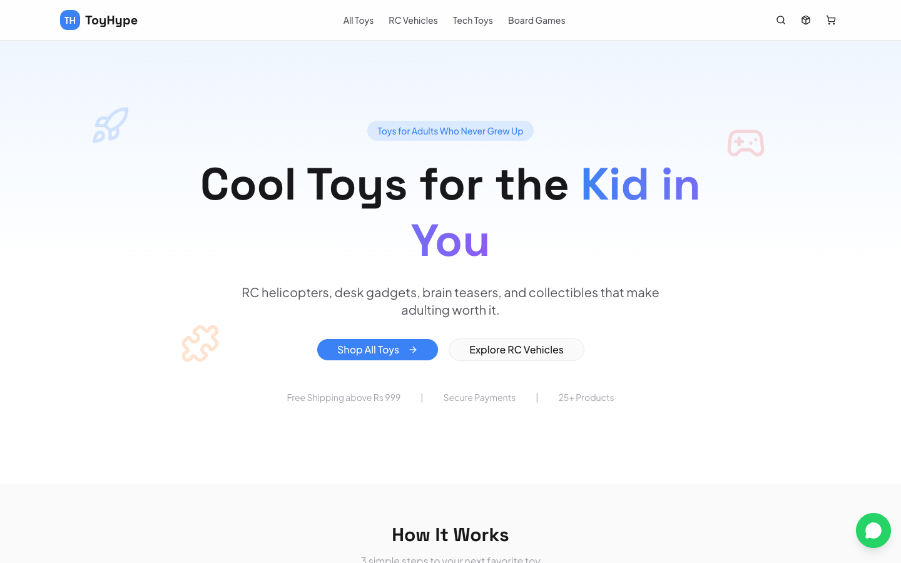

<p align="center">
  
</p>

# ToyHype

**COD-first e-commerce platform for the Indian market.**

**Live at [toyhype.vercel.app](https://toyhype.vercel.app)**



ToyHype is a full-stack e-commerce platform purpose-built for the Indian market where Cash on Delivery still dominates online purchases. Product catalog, cart, multi-payment checkout (Razorpay + COD), order tracking, and a complete admin panel. Built on Next.js 16 with React 19 server components and Supabase as the backend.

## Features

- **Product Catalog** -- Categorized product listings with search, filtering, and dynamic routing
- **Cart and Checkout** -- Persistent cart with address collection, coupon support, and order summary
- **Dual Payment Modes** -- Razorpay integration for online payments and Cash on Delivery for trust-first buyers
- **Order Tracking** -- Real-time order status updates with tracking page for customers
- **Shipping** -- Manual tracking number entry with courier selection
- **Admin Panel** -- Protected admin dashboard for product management, order fulfillment, and inventory control
- **Transactional Emails** -- Order confirmation and shipping updates via Resend + React Email templates
- **Responsive Design** -- Mobile-first UI with shadcn/ui components and Motion animations

## Tech Stack

| Layer | Technology |
|---|---|
| Framework | Next.js 16, React 19 |
| Styling | Tailwind CSS 4, shadcn/ui, Motion |
| Database | Supabase (PostgreSQL) |
| Auth | Supabase Auth + JWT (jose) |
| Payments | Razorpay |
| Shipping | Manual (courier + tracking number) |
| Email | Resend, React Email |
| Validation | Zod 4 |
| Deployment | Vercel |

## Project Structure

```
src/
  app/
    (public)/          -- Storefront pages (catalog, cart, checkout, tracking)
    (admin)/           -- Admin dashboard (products, orders, settings)
    api/               -- API routes (payments, webhooks, admin, orders)
  components/          -- Shared UI components
  lib/                 -- Utilities, Supabase client, helpers
supabase/              -- Database migrations and seed data
emails/                -- React Email templates
public/                -- Static assets
```

## Quick Start

```bash
# Install dependencies
npm install

# Set up environment variables
cp .env.example .env.local
# Fill in: SUPABASE_URL, SUPABASE_ANON_KEY, RAZORPAY_KEY_ID, RAZORPAY_KEY_SECRET, RESEND_API_KEY

# Run development server
npm run dev
```

Open [http://localhost:3000](http://localhost:3000) to browse the store.

## Environment Variables

| Variable | Purpose |
|---|---|
| `NEXT_PUBLIC_SUPABASE_URL` | Supabase project URL |
| `NEXT_PUBLIC_SUPABASE_ANON_KEY` | Supabase anonymous key |
| `RAZORPAY_KEY_ID` | Razorpay API key |
| `RAZORPAY_KEY_SECRET` | Razorpay secret |
| `RESEND_API_KEY` | Resend email API key |

---

Built with [Claude Code](https://claude.ai/code)
